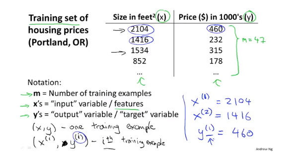
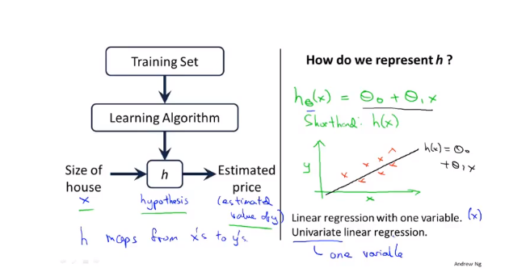
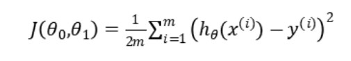
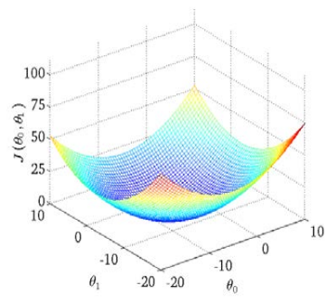

二、单变量线性回归(Linear Regression with One Variable)

### 2.1 模型表示

我们的第一个学习算法是线性回归算法。

它被称作监督学习是因为对于每个数据来说，我们给出了“正确的答案”，即告诉我们：根据我们的数据来说，房子实际的价格是多少，而且，更具体来说，这是一个回归问题。回归一词指的是，我们根据之前的数据预测出一个准确的输出值，对于这个例子就是价格，同时，还有另一种最常见的监督学习方式，叫做分类问题，当我们想要预测离散的输出值，例如，我们正在寻找癌症肿瘤，并想要确定肿瘤是良性的还是恶性的，这就是0/1离散输出的问题。更进一步来说，在监督学习中我们有一个数据集，这个数据集被称训练集。

我们将要用来描述这个回归问题的标记如下:

m代表训练集中训练样本的数量

x代表特征/输入变量

y代表目标变量/输出变量

( x,y )代表训练集中的实例

( x^(i),y^(i) )代表第i个观察实例

这就是一个监督学习算法的工作方式，我们可以看到这里有我们的训练集里房屋价格
我们把它喂给我们的学习算法，学习算法的工作了，然后输出一个函数，通常表示为小写 h表示。h 代表**hypothesis**(**假设**)，h表示一个函数，输入是房屋尺寸大小，就像你朋友想出售的房屋，因此h根据输入的x值来得出y值，y 值对应房子的价格 因此，h是一个从x到 y 的函数映射。

h代表学习算法的解决方案或函数也称为假设

那么，对于我们的房价预测问题，我们该如何表达 h？

我们的假设函数，也就是用来进行预测的函数，是这样的线性函数形式:

因为只含有一个特征/输入变量，因此这样的问题叫作单变量线性回归问题。

### 2.2 代价函数

我们将定义代价函数的概念，这有助于我们弄清楚如何把最有可能的直线与我们的数据相拟合。

在线性回归中我们有一个像这样的训练集，m代表了训练样本的数量。而我们的假设函数，也就是用来进行预测的函数，是这样的线性函数形式：

接下来我们会引入一些术语我们现在要做的便是为我们的模型选择合适的参数θ。

我们选择的参数决定了我们得到的直线相对于我们的训练集的准确程度，模型所预测的值与训练集中实际值之间的差距就是建模误差。

我们的目标便是选择出可以使得建模误差的平方和能够最小的模型参数。 即使得代价函数

最小。

我们绘制一个等高线图，三个坐标分别为θ0和θ1和J(θ0,θ1)：

则可以看出在三维空间中存在一个使得J(θ0,θ1)最小的点。

代价函数也被称作平方误差函数，有时也被称为平方误差代价函数。我们之所以要求出误差的平方和，是因为误差平方代价函数，对于大多数问题，特别是回归问题，都是一个合理的选择。还有其他的代价函数也能很好地发挥作用，但是平方误差代价函数可能是解决回归问题最常用的手段了。

### 2.3代价函数（一）

将代价函数简化来理解，假设只有一个参数θ1：

左边是假设函数，右边是代价函数。

对于给定的一个θ1会有一个对应的h(x)，,然后改变θ1，将每一个θ1在右边标出来，也会构成一个对应的J(θ1)。

可以看出来，拟合的最好的是θ1：=1时的情况。

### 2.4代价函数（二）

现在将θ0也加进来，这样就有两个参数，我们仍然要画出J(θ0,θ1)的图像：

这是一个3D曲面图，θ0和θ1构成底面，J(θ0,θ1)是高。

为了更好地展现图形，我们使用等高线图来展示代价函数J：

### 2.5梯度下降

梯度下降是一个用来求函数最小值的算法，我们将使用梯度下降算法来求出代价函数J(θ0,θ1)的最小值。

梯度下降背后的思想是：开始时我们随机选择一个参数的组合(θ0,θ1,θ2,...θn)，计算代价函数，然后我们寻找下一个能让代价函数值下降最多的参数组合。我们持续这么做直到到到一个**局部最小值**，因为我们并没有尝试完所有的参数组合，所以不能确定我们得到的局部最小值是否便是**全局最小值**，选择不同的初始参数组合，可能会找到不同的局部最小值。

在梯度下降算法中，还有一个更微妙的问题，梯度下降中，我们要更新θ0和θ1，当 j=0和j=1时，会产生更新，所以你将更新J(θ0)和J(θ1)。

实现梯度下降算法的微妙之处是，在这个表达式中，如果你要更新这个等式，你需要同时更新θ0和θ1。

实现方法是：你应该计算公式右边的部分，通过那一部分计算出θ0和θ1的值，然后同时更新θ0和θ1。

同步更新是更自然的实现方法。当人们谈到梯度下降时，他们的意思就是同步更新。

### 2.6梯度下降知识点总结

梯度下降算法如下：

描述：对θ赋值，使得J(θ)按梯度下降最快方向进行，一直迭代下去，最终得到局部最小值。其中α是**学习率**，它决定了我们沿着能让代价函数下降程度最大的方向向下迈出的步子有多大。

谈论微分求导项。

当θ在局部最小值右边时，其微分求导项为正数，因为α是正数，所以θ：=θ-正数，向左移向局部最小值。

当θ在局部最小值左边时，其微分求导项为负数，因为α是正数，所以θ：=θ-负数，向右移向局部最小值。

这就是梯度下降法的更新规则：

让我们来看看如果α太小或α太大会出现什么情况：

如果α太小了，即我的学习速率太小，结果就是只能这样像小宝宝一样一点点地挪动，去努力接近最低点，这样就需要很多步才能到达最低点，所以如果α太小的话，可能会很慢，因为它会一点点挪动，它会需要很多步才能到达全局最低点。

如果α太大，那么梯度下降法可能会越过最低点，甚至可能无法收敛，下一次迭代又移动了一大步，越过一次，又越过一次，一次次越过最低点，直到你发现实际上离最低点越来越远，所以，如果α太大，它会导致无法收敛，甚至发散。

如果你的参数已经处于局部最低点，那么梯度下降法更新其实什么都没做，它不会改变参数的值。这也解释了为什么即使学习速率。α保持不变时，梯度下降也可以收敛到局部最低点。

随着我接近最低点，我的导数越来越接近零，所以，梯度下降一步后，新的导数会变小一点点。所以，我再进行一步梯度下降时，我的导数项是更小的，θ更新的幅度就会更小。所以随着梯度下降法的运行，你移动的幅度会自动变得越来越小，直到最终移动幅度非常小，你会发现，已经收敛到局部极小值。

### 2.7线性回归的梯度下降

对我们之前的线性回归问题运用梯度下降法，关键在于求出代价函数的导数，即：

则算法改写成：

需要注意，θ0和θ1需要同步更新:

我们刚刚使用的算法，有时也称为**批量梯度下降**。实际上，在机器学习中，通常不太会给算法起名字，但这个名字批量梯度下降，指的是在梯度下降的每一步中，我们都用到了所有的训练样本，在梯度下降中，在计算微分求导项时，我们需要进行求和运算，所以，在每一个单独的梯度下降中，我们最终都要计算这样一个东西，这个项需要对所有m个训练样本求和。

在后面的课程中，我们也会谈到这个方法，它可以在不需要多步梯度下降的情况下，也能解出代价函数**J**的最小值，这是另一种称为**正规方程组**的方法。实际上在数据量较大的情况下，梯度下降法比正规方程要更适用一些。