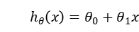

## 二、单变量线性回归(Linear Regression with One Variable)

### 2.1 模型表示

我们的第一个学习算法是线性回归算法。

它被称作监督学习是因为对于每个数据来说，我们给出了“正确的答案”，即告诉我们：根据我们的数据来说，房子实际的价格是多少，而且，更具体来说，这是一个回归问题。回归一词指的是，我们根据之前的数据预测出一个准确的输出值，对于这个例子就是价格，同时，还有另一种最常见的监督学习方式，叫做分类问题，当我们想要预测离散的输出值，例如，我们正在寻找癌症肿瘤，并想要确定肿瘤是良性的还是恶性的，这就是0/1离散输出的问题。更进一步来说，在监督学习中我们有一个数据集，这个数据集被称训练集。

我们将要用来描述这个回归问题的标记如下:

m代表训练集中训练样本的数量

x代表特征/输入变量

y代表目标变量/输出变量

( x,y )代表训练集中的实例

( x^(i),y^(i) )代表第i个观察实例

这就是一个监督学习算法的工作方式，我们可以看到这里有我们的训练集里房屋价格
我们把它喂给我们的学习算法，学习算法的工作了，然后输出一个函数，通常表示为小写 h表示。h 代表**hypothesis**(**假设**)，h表示一个函数，输入是房屋尺寸大小，就像你朋友想出售的房屋，因此h根据输入的x值来得出y值，y 值对应房子的价格 因此，h是一个从x到 y 的函数映射。

h代表学习算法的解决方案或函数也称为假设

那么，对于我们的房价预测问题，我们该如何表达 h？

我们的假设函数，也就是用来进行预测的函数，是这样的线性函数形式:

因为只含有一个特征/输入变量，因此这样的问题叫作单变量线性回归问题。

### 2.2 代价函数

我们将定义代价函数的概念，这有助于我们弄清楚如何把最有可能的直线与我们的数据相拟合。

在线性回归中我们有一个像这样的训练集，m代表了训练样本的数量。而我们的假设函数，也就是用来进行预测的函数，是这样的线性函数形式：

接下来我们会引入一些术语我们现在要做的便是为我们的模型选择合适的参数θ。

我们选择的参数决定了我们得到的直线相对于我们的训练集的准确程度，模型所预测的值与训练集中实际值之间的差距就是建模误差。

我们的目标便是选择出可以使得建模误差的平方和能够最小的模型参数。 即使得代价函数

最小。

我们绘制一个等高线图，三个坐标分别为和 和：

则可以看出在三维空间中存在一个使得最小的点。

代价函数也被称作平方误差函数，有时也被称为平方误差代价函数。我们之所以要求出误差的平方和，是因为误差平方代价函数，对于大多数问题，特别是回归问题，都是一个合理的选择。还有其他的代价函数也能很好地发挥作用，但是平方误差代价函数可能是解决回归问题最常用的手段了。